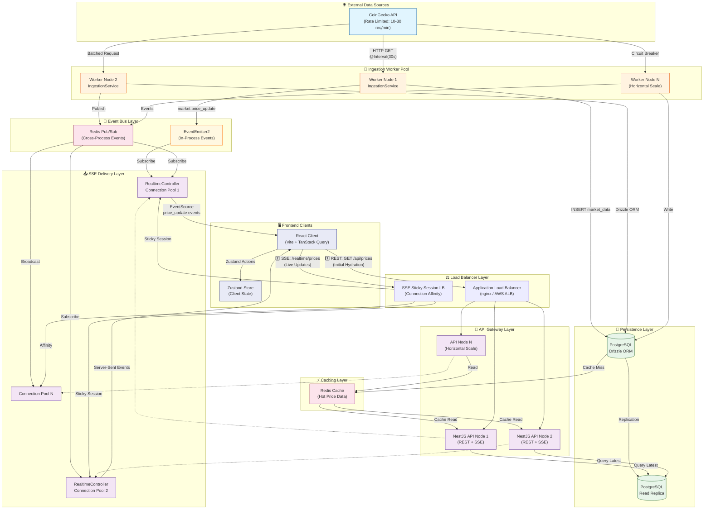

# 📊 Market Data Platform - Target Architecture

> **Version:** 2.0  
> **Last Updated:** 2026-01-22  
> **Status:** Aspirational — see "Current Implementation Status" below for what's deployed today

---

## Target Scalable Architecture



---

## 🔄 Data Flow - Technical Explanation

### Phase 1: Data Ingestion (Pull Model)

```
CoinGecko API ──[@Interval(30s)]──► IngestionService ──► PostgreSQL
                                          │
                                          └──► EventEmitter2.emit('market.price_update')
```

**Architecture Decision:** We use a **pull-based polling model** rather than WebSocket push because:
1. CoinGecko's free tier only provides REST endpoints (no WebSocket)
2. 30-second intervals respect rate limits while maintaining data freshness
3. Circuit breaker pattern (5 consecutive failures) prevents cascade failures
4. Exponential backoff on rate limits (429) preserves API access

**Resilience Features:**
- `consecutiveFailures` counter triggers circuit breaker
- `backoffMultiplier` implements exponential delay (1, 2, 4, 8... intervals)
- Graceful degradation: SSE continues serving cached data during outages

---

### Phase 2: Event Distribution (Internal Pub/Sub)

```
IngestionService ──► EventEmitter2 ──► RealtimeController (same process)
        │
        └──► Redis Pub/Sub ──► All API Nodes (cross-process, scalable)
```

**Current Implementation:** `EventEmitter2` for single-node simplicity.

**Scalable Path:** When horizontally scaling API nodes, events must cross process boundaries. Redis Pub/Sub provides:
- O(1) message broadcasting to all subscribers
- No message persistence (fire-and-forget for real-time data)
- Decoupled worker and API node lifecycles

---

### Phase 3: SSE Delivery (Push to Clients)

```
RealtimeController ──► Observable<MessageEvent> ──► EventSource (Browser)
        │
        ├── concat(of(connectionEvent), priceStream$)
        └── RxJS: fromEvent ──► map ──► catchError ──► finalize
```

**Key Design Patterns:**
1. **Connection Tracking:** `activeConnections` counter for observability
2. **Initial Event:** Immediate `connection` event so clients don't wait 30s
3. **Graceful Cleanup:** `finalize()` operator decrements counter on disconnect
4. **Error Isolation:** `catchError` returns `EMPTY` to prevent stream termination

**Scalability Considerations:**
- SSE requires sticky sessions (client must reconnect to same node)
- Load balancer uses connection affinity (IP hash or cookie-based)
- Each node manages its own connection pool independently

---

### Phase 4: Frontend Hybrid Hydration

```
Page Load ──► REST: GET /api/prices ──► Zustand.hydratePricesWithHistory()
                                                    │
                                                    ▼
              SSE: /realtime/prices ──────────► Zustand.updatePrice()
```

**Why Hybrid?** Pure SSE would leave the UI blank until the first event arrives (up to 30s). The hybrid approach:

| Step | Action | Purpose |
|------|--------|---------|
| 1️⃣ | `useQuery({ queryKey: ['prices', 'initial'] })` | Immediate data from DB |
| 2️⃣ | `hydratePricesWithHistory(prices, history)` | Populate Zustand store |
| 3️⃣ | `useSSE('/realtime/prices')` | Subscribe to live updates |
| 4️⃣ | `updatePrice(event.data)` | Merge SSE events into store |

**State Management Strategy:**
- `isHydrated` flag prevents REST data from overwriting fresher SSE data
- Selector pattern (`selectPrice(symbol)`) isolates re-renders per symbol
- `useShallow` for array comparisons (sparkline history)

---

## 🏗️ Scalability Path (Future)

### Horizontal Scaling Matrix

| Component | Scale Strategy | Bottleneck Mitigation |
|-----------|---------------|----------------------|
| **Ingestion Workers** | Partition by symbol | Leader election for same symbols |
| **API Nodes** | Stateless, add more | Load balancer round-robin |
| **SSE Nodes** | Sticky sessions | Connection-aware LB |
| **PostgreSQL** | Read replicas | Write to primary, read from replicas |
| **Redis** | Cluster mode | Shard by key prefix |

### Production Checklist

- [ ] **Redis Pub/Sub** for cross-node event distribution
- [ ] **Redis Cache** for hot price data (TTL: 30s)
- [ ] **PostgreSQL Read Replicas** for REST API queries
- [ ] **Health Checks** on `/health` endpoint
- [ ] **Metrics** (Prometheus): `sse_active_connections`, `ingestion_latency_ms`
- [ ] **Distributed Tracing** (OpenTelemetry) for request flows

---

## 📁 Current Implementation Status

| Layer | Status | Technology |
|-------|--------|------------|
| Ingestion | ✅ Implemented | `@nestjs/schedule`, `CoinGeckoClient` |
| Persistence | ✅ Implemented | Drizzle ORM, PostgreSQL |
| Events | ✅ Implemented | EventEmitter2 (single-node) |
| SSE Delivery | ✅ Implemented | `RealtimeController`, RxJS |
| REST API | ✅ Implemented | `PricesController` |
| Frontend | ✅ Implemented | React, Zustand, TanStack Query |
| Redis Cache | 🔲 Planned | Redis, `ioredis` |
| Redis Pub/Sub | 🔲 Planned | Cross-node events |
| Load Balancer | 🔲 Planned | nginx / AWS ALB |

---

> **Note:** The diagram above represents the **target scalable architecture**, not the current deployment. Today's implementation is single-node: one NestJS process with EventEmitter2 for in-process events. Redis and load balancing are the primary upgrade path for horizontal scaling.

